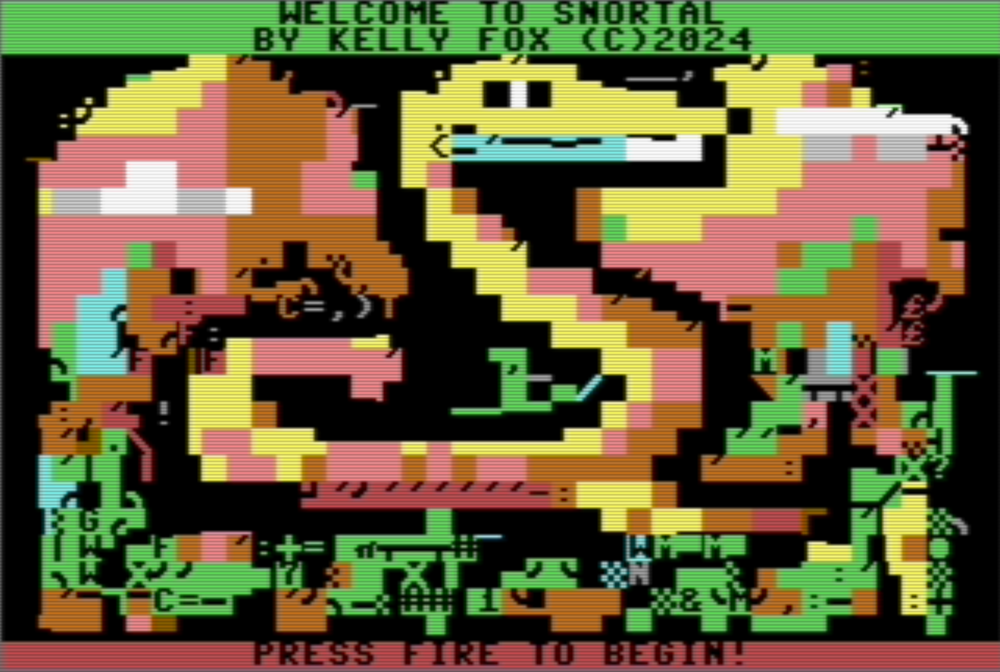

# snortal

## Snake meets Portal, for the Commodore 64

* Use the joystick in port #2.
* Avoid hitting the edges of the screen or yourself.
* The faster you grab the snake snacks, the more points you get.
* Travel through a portal to get to the snacks faster.
* The game speeds up every 100 points.

### Planned enhancements

* Sound effects
* A SID music soundtrack
* Custom character set
* Improved title screen
* High score loading/saving from/to disk
* Selectable controls (keyboard, joystick 1 or 2)
* Better file/code organization
* A Github Action to automatically build/release the code as a D64 disk image

### Known limitations and bugs

* Currently, only 256 snake body segments are being tracked. Exceeding 256 segments will likely result in some odd behavior.

### About

This game is my attempt to use the creative constraints of an 8-bit platform to solve challenges in interesting ways.
It is my response to a group challenge proposed in the [Central Texas Commodore Users' Group](https://github.com/Central-Texas-Commodore-Users-Group).
The code must be assembled and cross-compiled using [Kick Assembler](http://theweb.dk/KickAssembler/Main.html).
